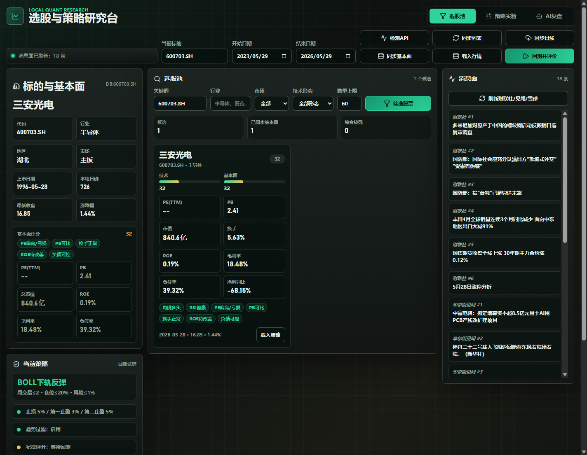
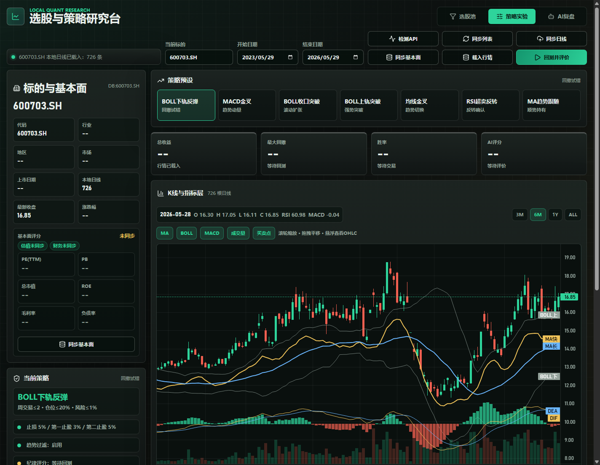

# Local Quant Research

一个本地运行的 A 股量化研究工作台，用来把交易纪律、技术形态、基本面数据和消息面热点放到同一个页面里复盘。它不是自动交易系统，也不会连接券商或真实账户，只用于研究、回测和策略验证。





## 现在能做什么

- 同步 Tushare A 股基础列表、日线行情、`daily_basic` 估值指标和 `fina_indicator` 财务指标。
- 用 PostgreSQL 持久化本地行情和基本面数据，重复同步按唯一键 upsert。
- 在选股池中查看技术评分、基本面质量评分、PE/PB、市值、换手率、ROE、毛利率、负债率、净利同比和形态标签。
- 建立自选标的池，并在全市场或指定标的池范围内批量验证同一套策略。
- 查看基本面质量榜，把盈利质量、成长性、资产负债、估值和流动性分红拆成可解释评分。
- 查看财联社、华尔街见闻、雪球热榜等真实消息源，不伪造新闻。
- 在策略实验页切换 BOLL、MACD、均线、RSI 等预设策略，并用交互式 K 线查看 MA、BOLL、MACD、成交量和买卖点。
- 在“质量诊断”页用基本面、技术面、情绪面和新闻面四个分析师视角评估指定标的，并输出研究评级。
- 调用 DeepSeek 生成策略复盘和质量诊断汇总；没有 `DEEPSEEK_TOKEN` 时会降级为本地规则评价。

## 技术栈

- 前端：React + Vite + lightweight-charts
- 后端：FastAPI + SQLAlchemy 2.0
- 数据库：PostgreSQL 16
- 数据源：Tushare Pro、NewsNow 热点源
- AI 评价：DeepSeek `deepseek-v4-flash`
- 运行方式：Docker Compose

## 快速启动

先复制环境变量模板，不要把真实 `.env` 提交到 Git：

```powershell
Copy-Item .env.example .env
notepad .env
```

至少填写：

```dotenv
TUSHARE_TOKEN=你的_tushare_token
DEEPSEEK_TOKEN=你的_deepseek_token
```

然后启动：

```powershell
.\启动回测系统.cmd
```

访问：

- 前端工作台：http://localhost:15173
- API 文档：http://localhost:18000/docs
- PostgreSQL：localhost:5432

修改依赖、Dockerfile、前端或后端代码后，使用：

```powershell
.\重新构建并启动回测系统.cmd
```

停止服务：

```powershell
.\停止回测系统.cmd
```

## 推荐使用流程

1. 打开前端工作台，点“检测 API”确认服务正常。
2. 点“同步列表”同步 A 股基础信息。
3. 输入股票代码，例如 `600703.SH`。
4. 点“同步日线”拉取本地区间行情。
5. 点“同步基本面”拉取估值和财务指标。
6. 在“选股池”里筛选候选，查看技术面、基本面和消息面。
7. 需要固定候选组合时，先建立自选标的池，再对池内标的运行批量验证。
8. 进入“策略实验”，调整策略参数并运行单票、标的池或全市场回测。
9. 在“质量诊断”查看指定标的的多 Agent 研究评级。
10. 在“AI复盘”查看 DeepSeek 或本地规则生成的策略评价。

## 质量诊断

质量诊断面向单个标的，入口在前端工作台的“质量诊断”页，也可以调用：

```text
GET /api/stocks/{ts_code}/quality-analysis?start_date=2023-05-30&end_date=2026-05-30&use_ai=true
```

它会先基于本地数据库生成四个分析师视角：

- 基本面分析师：使用估值和财务指标评估盈利质量、成长性、资产负债、估值和流动性分红。
- 技术分析师：使用 MA、BOLL、MACD、RSI、KDJ、ATR 等指标评估趋势和交易结构。
- 情绪分析师：使用已刷新财经新闻标题代理短线情绪；StockTwits 和 Reddit 暂未接入。
- 新闻分析师：汇总本地消息面标题，识别事件热度和潜在风险。

如果配置了 `DEEPSEEK_TOKEN`，后端会把本地证据交给 DeepSeek 生成综合结论；如果没有配置或调用失败，页面会显示本地多 Agent 规则诊断。输出的“买入 / 持有 / 中性 / 卖出”是研究评级，不是交易指令。

## 环境变量

`.env.example` 只保留占位值，可以提交；真实 `.env` 已被 `.gitignore` 忽略。

| 变量 | 说明 |
| --- | --- |
| `POSTGRES_DB` | PostgreSQL 数据库名 |
| `POSTGRES_USER` | PostgreSQL 用户名 |
| `POSTGRES_PASSWORD` | PostgreSQL 密码，本地默认值仅用于开发 |
| `POSTGRES_PORT` | 数据库宿主机端口，默认 `5432` |
| `API_PORT` | FastAPI 宿主机端口，默认 `18000` |
| `FRONTEND_PORT` | 前端宿主机端口，默认 `15173` |
| `TUSHARE_TOKEN` | Tushare Pro token，用于同步行情和财务数据 |
| `DEEPSEEK_TOKEN` | DeepSeek API token，用于策略 AI 复盘和质量诊断 |
| `DEEPSEEK_API_KEY` | `DEEPSEEK_TOKEN` 的兼容别名 |
| `DEEPSEEK_MODEL` | 默认 `deepseek-v4-flash` |
| `DEEPSEEK_API_BASE` | 默认 `https://api.deepseek.com` |
| `DEEPSEEK_TIMEOUT_SECONDS` | DeepSeek 请求超时秒数，默认 `25` |

## 数据表

- `stocks`：股票基础信息。
- `stock_daily_bars`：日线 OHLCV，按 `ts_code + trade_date` 去重。
- `stock_daily_basic`：Tushare `daily_basic`，包含 PE、PB、PS、换手率、市值等。
- `stock_financial_indicators`：Tushare `fina_indicator`，包含 ROE、毛利率、净利率、资产负债率、增长率等。
- `stock_pools`：自选标的池。
- `stock_pool_members`：自选标的池成员。
- `data_sync_runs`：同步记录。

## 交易纪律默认值

- 每周最多交易 2 次。
- 单票仓位上限 20%。
- 单笔风险上限 1%。
- 默认止损 5%。
- 第一止盈 3% 减半，第二止盈 5% 清仓。
- 退潮或弱势市场禁止开新仓。
- 盈利卖出当天禁止新买入。
- A 股默认按 100 股一手取整。

## 安全边界

- 本项目只做本地研究和复盘，不构成投资建议。
- 不接入券商，不自动下单，不处理真实账户资金。
- 不要提交 `.env`、真实 token、数据库密码或任何凭据。
- 不要执行 `docker compose down -v`，除非明确接受会删除本地 PostgreSQL volume 数据。

## 发布前检查

```powershell
git status --short --ignored
```

确认 `.env` 显示为 ignored，而 `.env.example`、README 和 `docs/images/` 正常进入提交。
